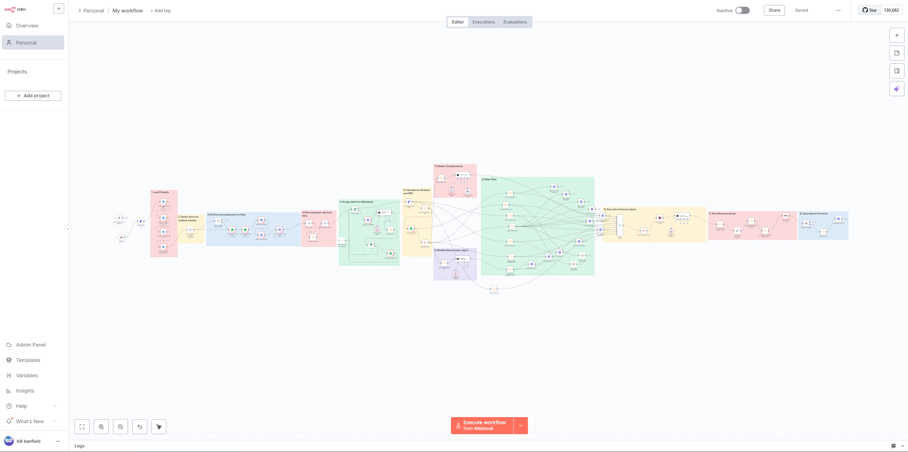
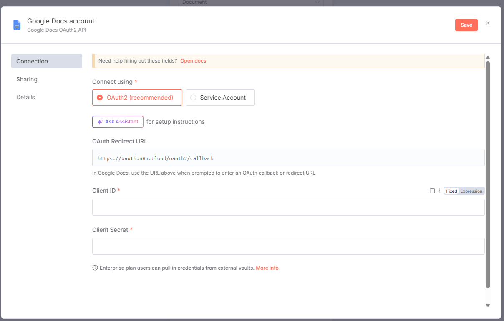

# Project Setup Guide

This guide will help you set up the Banfield Agentic Residual Analysis project environment and configure the necessary credentials.

## 1. n8n Environment Setup

The project uses n8n for workflow automation. You can access the n8n environment at:

**n8n Cloud URL:** https://ami-residual.app.n8n.cloud/home/workflows

### Accessing the Workflows

1. Navigate to the n8n Cloud URL above
2. Log in with your credentials
3. Once logged in, you'll see the workflow dashboard
4. **Select the "Residuals" workflow** to view and manage the automated processes

The n8n environment contains the automated workflows that handle:
- Data processing and analysis
- API integrations
- Webhook management
- Automated responses

## 2. Google Credentials Configuration

To integrate Google services with n8n, you'll need to set up OAuth credentials. This allows the workflows to access Google APIs for data processing and communication.

### Setting Up Google OAuth Credentials

### Detailed Setup Instructions

For comprehensive instructions on setting up Google OAuth credentials, refer to the official n8n documentation:

**[n8n Google OAuth Single Service Setup Guide](https://docs.n8n.io/integrations/builtin/credentials/google/oauth-single-service/?utm_source=n8n_app&utm_medium=credential_settings&utm_campaign=create_new_credentials_modal)**

### Key Steps for Google Integration:

1. **Create a Google Cloud Console Project**
   - Log in to Google Cloud Console
   - Create a new project or select an existing one

2. **Enable Required APIs**
   - Enable the specific Google APIs your workflows need
   - Common APIs include Gmail, Google Sheets, Google Drive, etc.

3. **Configure OAuth Consent Screen**
   - Set up the OAuth consent screen for your application
   - Configure app name, user support email, and authorized domains

4. **Create OAuth Client Credentials**
   - Create OAuth client ID and secret
   - Configure authorized redirect URIs
   - Copy the credentials to n8n

5. **Complete n8n Credential Setup**
   - Enter the Client ID and Client Secret in n8n
   - Complete the OAuth authentication flow
   - Save your credentials

### Important Notes:

- **Domain Configuration:** Make sure to add `n8n.cloud` to your authorized domains if using n8n Cloud
- **API Permissions:** Ensure you have the necessary API permissions enabled for your use case
- **Security:** Keep your OAuth credentials secure and never share them publicly
- **Testing:** For external apps, you may need to add test users to avoid verification warnings

### Troubleshooting:

If you encounter "Google hasn't verified this app" warnings:
- For internal apps: Use the same Google account for both OAuth creation and authentication
- For external apps: Add your email to the test users list in the OAuth consent screen

For more detailed troubleshooting, refer to the [n8n Google OAuth documentation](https://docs.n8n.io/integrations/builtin/credentials/google/oauth-single-service/?utm_source=n8n_app&utm_medium=credential_settings&utm_campaign=create_new_credentials_modal).

---

## Next Steps

Once you have completed the setup:
1. Verify you can access the n8n environment
2. Confirm the "Residuals" workflow is visible and accessible
3. Test the Google credentials integration
4. Review the workflow configurations and ensure all connections are properly established

For additional support or questions about the setup process, refer to the main project documentation or contact the development team.
