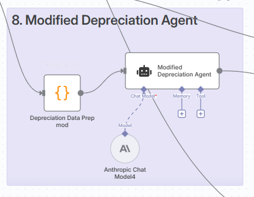

# Backend - n8n Agentic Residual Analysis Workflow

A sophisticated n8n workflow system that leverages multiple AI agents powered by Anthropic Claude Sonnet 4.0 to perform comprehensive equipment residual value analysis. This backend processes equipment data through webhooks and orchestrates various specialized agents to deliver detailed financial analysis and market insights.

## 🏗️ System Architecture

The backend consists of a complex n8n workflow that coordinates multiple AI agents to analyze equipment residual values:

- **Webhook Integration**: Receives equipment data from the frontend
- **Multi-Agent Processing**: Orchestrates specialized AI agents for different analysis types
- **Data Collection**: Web scraping and market research capabilities
- **Financial Modeling**: Advanced depreciation and residual value calculations
- **Report Generation**: Comprehensive analysis with visualizations and recommendations

## 🤖 AI Agents Overview

All agents utilize **Anthropic Claude Sonnet 4.0** for consistent, high-quality analysis:

### Primary Agents

1. **Market Value Agent** - Analyzes comparable equipment and market positioning
2. **Inflation Agent** - Evaluates economic factors and inflation impact
3. **Executive Summary Agent** - Generates high-level insights and recommendations
4. **Modified Depreciation Agent** - Calculates MACRS schedules and depreciation curves

### Supporting Components

- **Firecrawl Integration** - Web scraping for market data collection
- **Google Sheets Integration** - Data storage and collaboration
- **Email Notifications** - Automated reporting and alerts
- **Data Visualization** - Charts, plots, and tables generation

## 📋 Workflow Components

### Data Processing Pipeline

1. **Input Validation** - Validates incoming equipment data
2. **Market Research** - Scrapes comparable equipment data
3. **Financial Analysis** - Calculates residual values and depreciation
4. **Inflation Analysis** - Evaluates economic impact factors
5. **Report Assembly** - Combines all analysis into comprehensive output
6. **Response Generation** - Returns structured JSON to frontend

### Key Nodes

- **Anthropic Chat Models** - Multiple instances for different analysis types
- **Firecrawl Nodes** - Web scraping and data collection
- **Google Sheets Nodes** - Data storage and retrieval
- **Loop Nodes** - Iterative processing of multiple data sources
- **Merge Nodes** - Data aggregation and combination
- **Output Formatting** - JSON response generation

## 🔧 Setup Instructions

### Prerequisites

- n8n instance (cloud or self-hosted)
- Anthropic API key with Claude Sonnet 4.0 access
- Firecrawl API key for web scraping
- Google Sheets API credentials
- Gmail API credentials (optional, for notifications)

### Installation

1. **Import Workflow**
   ```bash
   # Import the workflow JSON file into your n8n instance
   Banfield_Agentic_Residual_Workflow_Backend.json
   ```

2. **Configure Credentials**
   - **Anthropic API**: Set up Claude Sonnet 4.0 access
   - **Firecrawl**: Configure web scraping API
   - **Google Sheets**: Set up data storage integration
   - **Gmail**: Configure email notifications (optional)

3. **Environment Variables**
   ```env
   ANTHROPIC_API_KEY=your_anthropic_api_key
   FIRECRAWL_API_KEY=your_firecrawl_api_key
   GOOGLE_SHEETS_CREDENTIALS=your_google_credentials
   GMAIL_CREDENTIALS=your_gmail_credentials
   ```

4. **Webhook Configuration**
   - Set up webhook endpoint for receiving equipment data
   - Configure response format for frontend integration
   - Test with sample equipment data

### Workflow Configuration

The workflow includes several key sections:

- **Data Collection**: Web scraping and market research
- **AI Analysis**: Multi-agent processing with Claude Sonnet 4.0
- **Financial Calculations**: Residual value and depreciation modeling
- **Report Generation**: Comprehensive analysis output
- **Data Storage**: Google Sheets integration for persistence

## 📊 Workflow Screenshots

### 
**Main Workflow Overview** - Complete n8n workflow canvas showing the entire agentic residual analysis system. Displays the orchestration of multiple AI agents, data processing nodes, and integration points. Features the main workflow structure with webhook input, agent processing, and response generation pathways.

### 
**AI Agent Configuration** - Detailed view of the Anthropic Claude Sonnet 4.0 agent setup and configuration. Shows the Market Value Agent and Executive Summary Agent configurations with their specialized prompts and processing parameters. Includes agent retry logic and error handling settings.

### 
**Data Collection Pipeline** - Firecrawl web scraping integration and data processing nodes. Displays the market research workflow including URL processing, data extraction, and comparable equipment analysis. Shows the loop structure for processing multiple data sources.

### 
**Financial Calculations** - Residual value and depreciation calculation nodes. Features the Modified Depreciation Agent configuration and MACRS schedule processing. Shows the mathematical modeling for equipment value projections over time.

### 
**Inflation Analysis** - Economic impact analysis and inflation data processing. Displays the Inflation Agent configuration and CPI data integration. Shows how economic factors are incorporated into residual value calculations.

### 
**Data Storage Integration** - Google Sheets integration for data persistence and collaboration. Shows the data storage workflow including market comparisons and residual calculations sheets. Features public sharing configuration for generated reports.

### 
**Report Generation** - Comprehensive report assembly and formatting nodes. Displays the executive summary generation, data visualization creation, and final JSON response formatting. Shows how all analysis components are combined into the final output.

### 
**Response Output** - Final workflow output and webhook response configuration. Shows the complete JSON response structure being sent back to the frontend. Features error handling, data validation, and response formatting for seamless frontend integration.

## 🔄 Workflow Execution

### Processing Steps

1. **Webhook Reception** - Receives equipment data from frontend
2. **Data Validation** - Validates input parameters and equipment information
3. **Market Research** - Scrapes comparable equipment data using Firecrawl
4. **AI Analysis** - Processes data through multiple Claude Sonnet 4.0 agents
5. **Financial Modeling** - Calculates residual values and depreciation schedules
6. **Report Assembly** - Combines all analysis into comprehensive report
7. **Response Generation** - Returns structured JSON to frontend

### Processing Time

- **Total Duration**: 6-8 minutes for complete analysis
- **Market Research**: 2-3 minutes for data collection
- **AI Analysis**: 3-4 minutes for agent processing
- **Report Generation**: 1-2 minutes for final assembly

### Error Handling

- **Retry Logic**: Automatic retry for failed agent requests
- **Timeout Management**: Handles long-running processes
- **Data Validation**: Input validation and error reporting
- **Fallback Mechanisms**: Graceful degradation for unavailable services

## 📈 Performance Optimization

### Caching Strategy

- **Agent Response Caching**: Caches AI agent responses for similar equipment
- **Market Data Caching**: Stores scraped market data for reuse
- **Calculation Caching**: Caches financial calculations for efficiency

### Scalability Features

- **Concurrent Processing**: Handles multiple simultaneous requests
- **Resource Management**: Efficient use of API quotas and resources
- **Load Balancing**: Distributes processing across available resources

## 🔗 Integration Points

### Frontend Integration

- **Webhook Communication**: Receives equipment data via webhook
- **Async Processing**: Long-running analysis with status updates
- **Response Format**: Structured JSON for frontend consumption

### External Services

- **Anthropic API**: Claude Sonnet 4.0 for AI analysis
- **Firecrawl**: Web scraping for market data
- **Google Sheets**: Data storage and collaboration
- **Gmail**: Email notifications and reporting

## 🛠️ Troubleshooting

### Common Issues

1. **API Rate Limits**: Monitor Anthropic and Firecrawl API usage
2. **Webhook Timeouts**: Configure appropriate timeout settings
3. **Data Quality**: Validate scraped data for accuracy
4. **Agent Failures**: Check agent prompts and retry logic

### Debug Tools

- **n8n Execution Logs**: Detailed workflow execution tracking
- **Agent Response Logs**: Individual agent processing logs
- **Data Validation**: Input and output validation checks
- **Performance Monitoring**: Processing time and resource usage

## 📚 Documentation

### Related Files

- **Workflow JSON**: `Banfield_Agentic_Residual_Workflow_Backend.json`
- **Frontend Integration**: See main project README for API examples
- **Agent Prompts**: Stored in Google Docs for easy management

### API Reference

- **Webhook Endpoint**: Receives equipment data
- **Response Format**: Structured JSON with analysis results
- **Error Codes**: Standard HTTP status codes with detailed messages

## 🤝 Contributing

This backend system is proprietary software developed for Asset Management International (AMI). For technical support, feature requests, or deployment assistance, contact the development team.

## 📄 License

Proprietary software developed for Asset Management International (AMI). All rights reserved.
